# Verdex Plant Identification System - Use Case Diagram

## Comprehensive UML Use Case Diagram

```mermaid
graph TB
    %% Actors
    User((User))
    Admin((Admin))
    System((System))
    MLModel((ML Model))
    Database((Database))
    NotificationService((Notification Service))

    %% System Boundary
    subgraph "Verdex Plant Identification System"
        %% User Use Cases
        UC1[Register Account]
        UC2[Login/Logout]
        UC3[Identify Plant]
        UC4[View Plant Library]
        UC5[Search Plants]
        UC6[View Plant Details]
        UC7[Submit Feedback]
        UC8[Receive Notifications]
        UC9[Manage Profile]
        UC10[Change Password]
        UC11[View Recently Identified]
        UC12[Browse Categories]
        UC13[Access Offline Content]
        UC14[Rate Identification]

        %% Admin Use Cases
        UC15[Manage Plants]
        UC16[Manage Categories]
        UC17[Manage Users]
        UC18[Respond to Feedback]
        UC19[View Analytics]
        UC20[Manage Settings]
        UC21[View Activity Logs]
        UC22[Manage Translations]
        UC23[Upload Images]
        UC24[Manage Toxicity Info]

        %% System Use Cases
        UC25[Send Notifications]
        UC26[Log Activities]
        UC27[Process Identification]
        UC28[Cache Data]
        UC29[Generate Reports]
        UC30[Handle Authentication]
        UC31[Sync Data]

        %% Include Relationships
        UC3 -.->|include| UC27
        UC7 -.->|include| UC26
        UC8 -.->|include| UC25
        UC15 -.->|include| UC22
        UC15 -.->|include| UC23
        UC15 -.->|include| UC24
        UC18 -.->|include| UC25
        UC19 -.->|include| UC29

        %% Extend Relationships
        UC3 -.->|extend| UC14
        UC6 -.->|extend| UC7
        UC4 -.->|extend| UC12
        UC4 -.->|extend| UC5
    end

    %% Actor Associations
    User --> UC1
    User --> UC2
    User --> UC3
    User --> UC4
    User --> UC5
    User --> UC6
    User --> UC7
    User --> UC8
    User --> UC9
    User --> UC10
    User --> UC11
    User --> UC12
    User --> UC13
    User --> UC14

    Admin --> UC15
    Admin --> UC16
    Admin --> UC17
    Admin --> UC18
    Admin --> UC19
    Admin --> UC20
    Admin --> UC21
    Admin --> UC22
    Admin --> UC23
    Admin --> UC24

    System --> UC25
    System --> UC26
    System --> UC27
    System --> UC28
    System --> UC29
    System --> UC30
    System --> UC31

    %% External System Associations
    MLModel --> UC27
    Database --> UC26
    Database --> UC28
    Database --> UC31
    NotificationService --> UC25
    NotificationService --> UC8

    %% Styling
    classDef actor fill:#e1f5fe,stroke:#01579b,stroke-width:2px
    classDef useCase fill:#f3e5f5,stroke:#4a148c,stroke-width:2px
    classDef system fill:#e8f5e8,stroke:#1b5e20,stroke-width:3px

    class User,Admin,System,MLModel,Database,NotificationService actor
    class UC1,UC2,UC3,UC4,UC5,UC6,UC7,UC8,UC9,UC10,UC11,UC12,UC13,UC14,UC15,UC16,UC17,UC18,UC19,UC20,UC21,UC22,UC23,UC24,UC25,UC26,UC27,UC28,UC29,UC30,UC31 useCase
```

## Actor Analysis

| Actor | Description | Primary Responsibilities |
|-------|-------------|-------------------------|
| **User** | End-user of the mobile Flutter application | Plant identification, library browsing, feedback submission, profile management |
| **Admin** | System administrator managing content and user feedback | Content management, user administration, feedback response, analytics review |
| **System** | Automated backend processes and services | Notification delivery, activity logging, data processing, synchronization |
| **ML Model** | Machine learning model for plant identification | Image processing and plant classification |
| **Database** | Data storage system | Data persistence, retrieval, and management |
| **Notification Service** | Automated notification system | Push notifications, email delivery, in-app notifications |

## Use Case Descriptions

### User Use Cases
- **Register Account**: Create new user account with email and password
- **Login/Logout**: Authenticate user and manage session
- **Identify Plant**: Capture/upload image and get plant identification results
- **View Plant Library**: Browse comprehensive plant database
- **Search Plants**: Find specific plants by name, category, or characteristics
- **View Plant Details**: Access detailed information about specific plants
- **Submit Feedback**: Provide feedback on app functionality or plant identification
- **Receive Notifications**: Get updates about feedback responses and system updates
- **Manage Profile**: Update personal information and preferences
- **Change Password**: Update account security credentials
- **View Recently Identified**: Access history of plant identifications
- **Browse Categories**: Explore plants by categories (trees, flowers, etc.)
- **Access Offline Content**: Use cached data when offline
- **Rate Identification**: Provide accuracy rating for identification results

### Admin Use Cases
- **Manage Plants**: Create, read, update, delete plant records
- **Manage Categories**: Organize plants into categories
- **Manage Users**: Administer user accounts and permissions
- **Respond to Feedback**: Provide responses to user feedback
- **View Analytics**: Monitor system usage and performance metrics
- **Manage Settings**: Configure system parameters
- **View Activity Logs**: Monitor user activities and system events
- **Manage Translations**: Handle multi-language content
- **Upload Images**: Add plant images to the database
- **Manage Toxicity Info**: Update plant safety information

### System Use Cases
- **Send Notifications**: Deliver notifications to users
- **Log Activities**: Record user actions and system events
- **Process Identification**: Handle plant identification requests
- **Cache Data**: Store data for offline access
- **Generate Reports**: Create analytics and usage reports
- **Handle Authentication**: Manage user authentication tokens
- **Sync Data**: Synchronize data between online and offline storage

## Key Relationships

### Include Relationships
- Plant identification includes processing identification requests
- Feedback submission includes activity logging
- Notification reception includes notification sending
- Plant management includes translation and image management
- Feedback response includes notification sending
- Analytics viewing includes report generation

### Extend Relationships
- Plant identification can be extended with rating functionality
- Plant details viewing can be extended with feedback submission
- Plant library viewing can be extended with category browsing
- Plant library viewing can be extended with search functionality

This use case diagram provides a comprehensive view of the Verdex system's functionality, showing how different actors interact with the system and how use cases relate to each other through include and extend relationships. 