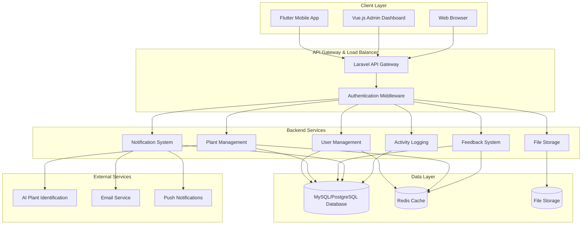
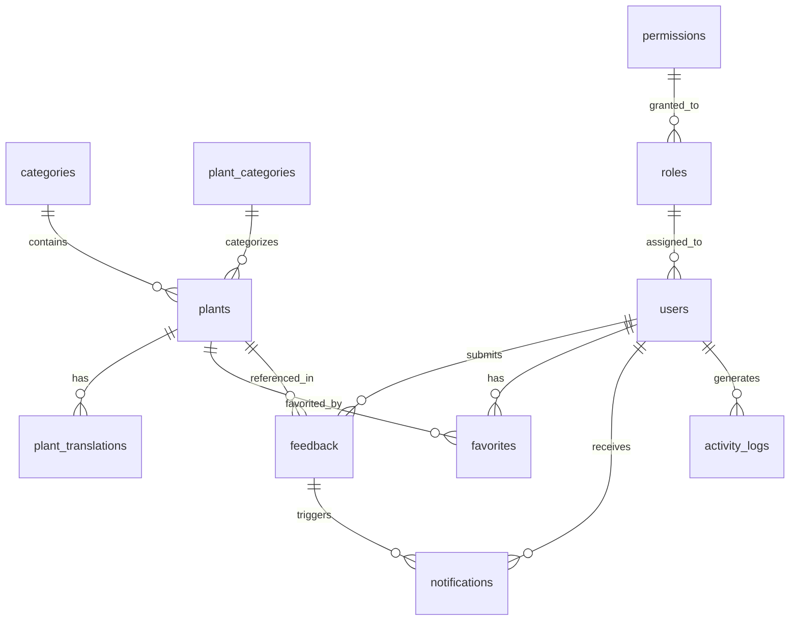
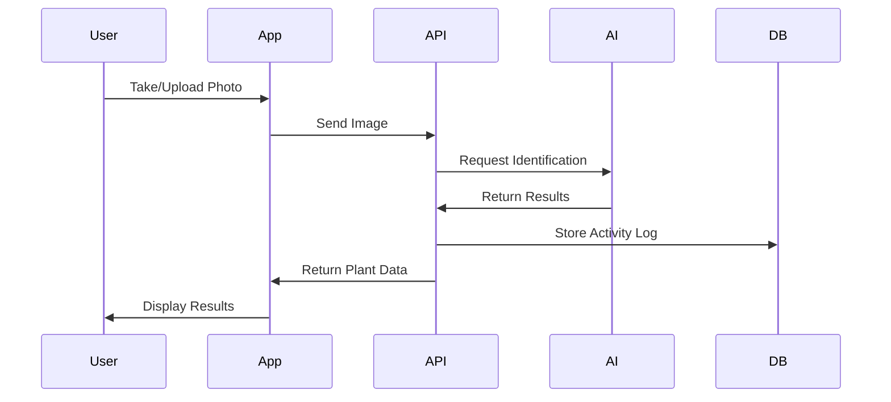
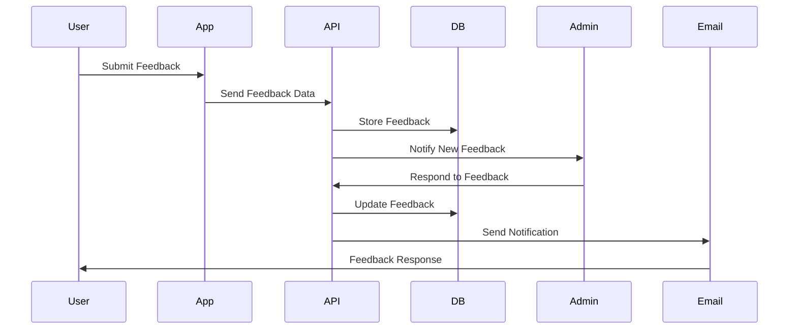
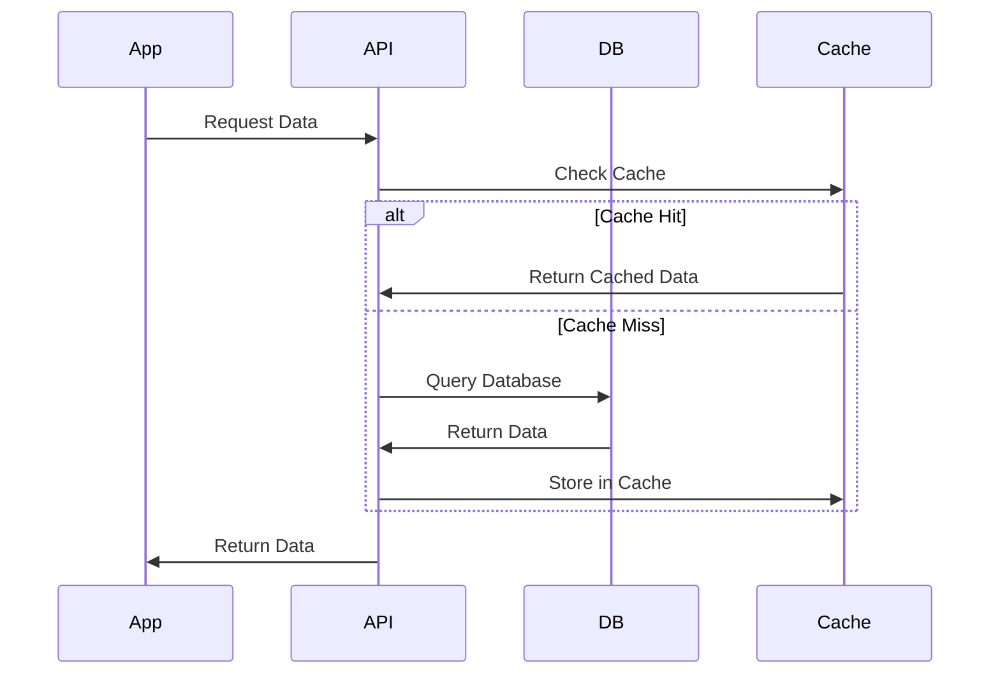
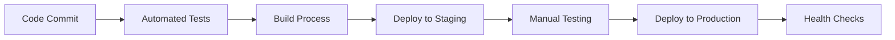

# Verdex System Architecture

## Overview
Verdex is a plant identification application with a multi-platform architecture consisting of a Laravel backend API, Flutter mobile app, and Vue.js admin dashboard.

## System Architecture Diagram



## Detailed Component Architecture

### 1. Client Layer

#### Flutter Mobile App
- **Platforms**: iOS, Android, Web
- **Key Features**:
  - Plant identification via camera/gallery
  - Plant library browsing
  - User authentication
  - Offline data caching
  - Push notifications
  - Multi-language support

#### Vue.js Admin Dashboard
- **Platform**: Web-based
- **Key Features**:
  - User management
  - Plant data management
  - Feedback management
  - Analytics and reporting
  - Content management

### 2. API Layer

#### Laravel Backend
- **Framework**: Laravel 10.x
- **API**: RESTful API with Sanctum authentication
- **Key Components**:
  - Authentication & Authorization
  - Request/Response handling
  - Data validation
  - Error handling
  - Rate limiting

### 3. Service Layer

#### Core Services
1. **User Management Service**
   - User registration/login
   - Profile management
   - Role-based access control
   - Password reset

2. **Plant Management Service**
   - Plant CRUD operations
   - Plant identification
   - Category management
   - Translation management

3. **Feedback System Service**
   - Feedback submission
   - Admin response management
   - Feedback analytics

4. **Notification Service**
   - Real-time notifications
   - Email notifications
   - Push notifications
   - Notification preferences

5. **File Storage Service**
   - Image upload/management
   - File validation
   - Storage optimization

6. **Activity Logging Service**
   - User activity tracking
   - System audit logs
   - Performance monitoring

### 4. Data Layer

#### Database Schema


#### Key Tables
- `users` - User accounts and profiles
- `plants` - Plant information
- `plant_translations` - Multi-language plant data
- `categories` - Plant categories
- `feedback` - User feedback
- `notifications` - System notifications
- `activity_logs` - User activity tracking
- `roles` & `permissions` - Access control
- `favorites` - User favorite plants

### 5. External Integrations

#### AI Plant Identification
- **Service**: External AI service
- **Integration**: API calls for plant identification
- **Data**: Image processing and classification

#### Email Service
- **Service**: Laravel Mail
- **Features**: 
  - Password reset emails
  - Feedback response notifications
  - System announcements

#### Push Notifications
- **Service**: Firebase Cloud Messaging
- **Features**:
  - Real-time notifications
  - Feedback responses
  - System updates

## Data Flow Architecture

### 1. Plant Identification Flow


### 2. Feedback System Flow


### 3. Real-time Sync Flow


## Security Architecture

### 1. Authentication & Authorization
- **Method**: Laravel Sanctum (Token-based)
- **Features**:
  - JWT tokens
  - Token expiration
  - Role-based access control
  - Permission-based authorization

### 2. Data Protection
- **Encryption**: Laravel's built-in encryption
- **Validation**: Request validation
- **Sanitization**: Input sanitization
- **CORS**: Cross-origin resource sharing protection

### 3. API Security
- **Rate Limiting**: Request throttling
- **CSRF Protection**: Cross-site request forgery protection
- **SQL Injection**: Eloquent ORM protection
- **XSS Protection**: Output escaping

## Performance Architecture

### 1. Caching Strategy
- **Application Cache**: Redis for session data
- **Database Cache**: Query result caching
- **File Cache**: Static asset caching
- **API Cache**: Response caching

### 2. Database Optimization
- **Indexing**: Strategic database indexing
- **Query Optimization**: Efficient Eloquent queries
- **Connection Pooling**: Database connection management
- **Read Replicas**: Database scaling (future)

### 3. CDN & Asset Delivery
- **Static Assets**: CDN for images and files
- **Compression**: Gzip compression
- **Minification**: CSS/JS minification
- **Caching Headers**: Proper cache headers

## Scalability Architecture

### 1. Horizontal Scaling
- **Load Balancing**: Multiple server instances
- **Database Sharding**: Data distribution (future)
- **Microservices**: Service decomposition (future)

### 2. Vertical Scaling
- **Resource Optimization**: Memory and CPU optimization
- **Database Optimization**: Query and index optimization
- **Caching**: Multi-layer caching strategy

### 3. Monitoring & Analytics
- **Application Monitoring**: Performance tracking
- **Error Tracking**: Exception monitoring
- **User Analytics**: Usage statistics
- **System Health**: Infrastructure monitoring

## Deployment Architecture

### 1. Environment Structure
```
Production
├── Load Balancer
├── Web Servers (Multiple)
├── Database Cluster
├── Redis Cluster
├── File Storage
└── CDN

Staging
├── Web Server
├── Database
├── Redis
└── File Storage

Development
├── Local Environment
├── Database
└── File Storage
```

### 2. CI/CD Pipeline


## Technology Stack

### Backend
- **Framework**: Laravel 10.x
- **Language**: PHP 8.x
- **Database**: MySQL/PostgreSQL
- **Cache**: Redis
- **Authentication**: Laravel Sanctum
- **File Storage**: Local/Cloud Storage

### Frontend (Mobile)
- **Framework**: Flutter
- **Language**: Dart
- **State Management**: Provider
- **HTTP Client**: http package
- **Local Storage**: SharedPreferences

### Frontend (Admin)
- **Framework**: Vue.js 3
- **Language**: JavaScript/TypeScript
- **UI Library**: Bootstrap
- **HTTP Client**: Axios
- **State Management**: Vuex

### Infrastructure
- **Web Server**: Nginx/Apache
- **Application Server**: PHP-FPM
- **Database**: MySQL/PostgreSQL
- **Cache**: Redis
- **File Storage**: Local/Cloud
- **CDN**: CloudFlare/AWS CloudFront

## Future Enhancements

### 1. Microservices Architecture
- **Service Decomposition**: Break down into microservices
- **API Gateway**: Centralized API management
- **Service Discovery**: Dynamic service registration
- **Circuit Breaker**: Fault tolerance patterns

### 2. Real-time Features
- **WebSockets**: Real-time communication
- **Laravel Echo**: Broadcasting system
- **Pusher**: Real-time notifications
- **Live Updates**: Real-time data synchronization

### 3. Advanced Analytics
- **Data Warehouse**: Centralized analytics
- **Machine Learning**: Predictive analytics
- **A/B Testing**: Feature experimentation
- **User Behavior**: Advanced user analytics

This architecture provides a solid foundation for the Verdex application with room for future growth and scalability. 